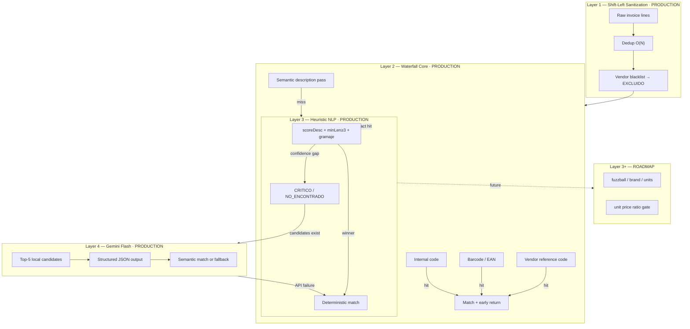
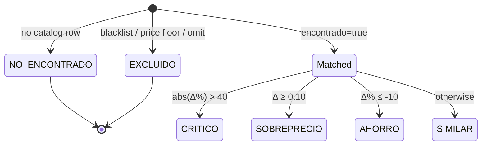
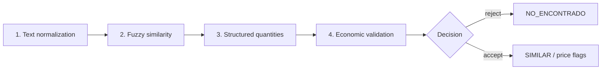

# Axial Audit — Hybrid Catalog-Matching Engine

> **Enterprise-Grade Data Pipeline — A high-performance, cost-optimized processing funnel merging deterministic NLP heuristics with selective Google Gemini arbitration.**

[](https://www.typescriptlang.org)
[](https://nodejs.org)
[](https://react.dev)
[](https://ai.google.dev)

---


---

## Executive Summary

**Axial Audit** is a B2B invoice-auditing platform that reconciles unstructured invoice line items—typically produced by noisy OCR and supplier-specific abbreviations—against an internal **Catalogo Maestro** of **11,000+** reference products.

The **Gemini Engine Module** implements a **hybrid funnel**: four deterministic layers process the majority of lines at **$0** marginal API cost; **Google Gemini 2.5 Flash** performs selective semantic arbitration on the residual tail when local ranking has already produced candidates.

**Production baseline (stress lot $N = 3{,}327$ lines):** shift-left sanitization, vendor blacklists, and the deployed heuristic NLP core (including the **`minLen \geq 3`** prefix sovereignty rule) lift nominal identity resolution to **$84.34\%$** on **$2{,}533$** sanitized lines. The Flash oracle closes the remaining **$15\text{–}20\%$** semantic gap for **$< \$0.01$** per batch.

**Structural risks still under active engineering** (not conflated with match-rate):

| Risk class | Symptom | Root cause |
|---|---|---|
| **Textual (tail)** | Residual OCR false negatives | No continuous fuzzy ratio in Layer 3 (planned Layer 3+) |
| **Economic** | Correct SKU → `CRITICO`, or wrong SKU accepted | Line price vs catalog without unit-normalized ratio gates |

### Accuracy Optimization Progression Matrix

* **Raw OCR Output Ingestion (Baseline Data Volume):** `[64.0%]`
    <progress value="64" max="100" style="width:250px;"></progress>
* **Shift-Left Sanitization Layer (Negative values & Blacklists applied):** `[71.4%]`
    <progress value="71.4" max="100" style="width:250px;"></progress>
* **Heuristic NLP Core Engine (Prefix Optimization & minLen >= 3):** `[84.34%]`
    <progress value="84.34" max="100" style="width:250px;"></progress>
* **Hybrid Gemini 2.5 Flash Oracle (Semantic Arbitration Tail):** `[95.0%]`
    <progress value="95" max="100" style="width:250px;"></progress>

*Conservative stress-tested nominal rate after $\pm 5\%$ false-positive penalty on the NLP stage: **$80.12\%$** (same $2{,}533$-line corpus).*

This path is the architectural showcase (documentation + diagrams + assets).

### Walkthrough (100% mocked data)

<p align="center">
  
  
  
  
</p>

---

## Table of Contents

1. [System Overview & Architectural Philosophy](#section-1-system-overview--architectural-philosophy)
2. [The Multi-Tiered Pipeline](#section-2-the-multi-tiered-pipeline-step-by-step)
3. [Empirical Performance & Production Data](#section-3-empirical-performance--production-data)
4. [Code Architecture & Directory Map](#section-4-code-architecture--directory-map)
5. [Structural Limitations & Evolution Roadmap](#section-5-structural-limitations--evolution-roadmap)
6. [Configuration & Operations](#configuration--operations)
7. [License](#license)

---

## 📖 SECTION 1: SYSTEM OVERVIEW & ARCHITECTURAL PHILOSOPHY

### Context

Axial Audit ingests supplier invoices (PDF/image), extracts line items via Gemini Specialist extraction upstream, and **audits** each line by locating the corresponding catalog row and comparing net prices. The problem is **high-recall identity resolution** under aggressive text distortion at warehouse scale.

### The Core Problem

| Failure mode | Example | Why naive matching breaks |
|---|---|---|
| Extreme abbreviation | `RUT. M. T. 3/4L` → `Vino Tinto Malbec Rutini 750ml` | Sparse overlap; no partial recovery |
| OCR noise | `AQ POMELO` vs `AQUARIUS POMELO` | Character corruption |
| Pack / unit confusion | `72x55g` vs `2x55g` | Identical tokens, different wholesale semantics |
| Broken economics | `$ 32.144,43` vs `$ 55,10` as strings | No normalized magnitude comparison |
| Single-character collisions | Token `a` in `Malbec` (substring) | Unrestricted `startsWith` |
| Cost at scale | `3,000+` lines × frontier LLM | Unsustainable per batch |

### Capability strata

| Stratum | Status | Scope |
|---|---|---|
| **Core stable (Layers 1–3)** | **Deployed in production** | Dedup `O(N)`, blacklists, waterfall, `SHORT_WHITELIST`, `STOP_WORDS`, **`minLen >= 3`**, dynamic score floor, gramaje gate |
| **Oracle (Layer 4)** | **Deployed** (selective) | Top-5 Flash JSON arbitration |
| **Layer 3+ evolution** | **Roadmap** | `fuzzball`, total pack mass, unit-price ratio fusion |

### Product capabilities (beyond the matching engine)

The engine is the technical core, but the deployed product is a full operator workflow around it:

- **MatchCache — persistent cross-batch learning.** Every mapping an operator confirms between a scanned line and a catalog product is stored per-supplier (signature `firmaProducto`) and **auto-applied to future invoices**, so a correction made once becomes a permanent automatic match. The **Bandeja de Mapeos** surfaces confirmed mappings and the ones still pending review.
- **Multi-supplier batch + scout grouping.** A batch of many invoice pages is grouped **by CUIT read from each image**, so each supplier's invoice is audited under its own rules — even when everything is uploaded together.
- **Per-supplier rules (`ProveePrompt`).** Each supplier can carry its own extraction prompt, waterfall priorities, blacklists and business rules.
- **Mobile QR upload.** Scan a QR to add photos from a phone into the current batch — designed for multi-page invoices captured on the spot.
- **Catálogo Maestro sync.** The reference catalog syncs daily from **Access → Google Sheets → MongoDB**; the *Catálogo Access* view lets the operator confirm at a glance that costs were refreshed.
- **Manual mapping, exclusions & OCR correction.** Operators can map/unmap, exclude non-product lines (freight, promos, percepciones), and fix OCR errors (internal code / barcode / description / price) inline, each triggering a re-audit.
- **Financial estado semaphore.** Every line is classified `SIMILAR` / `SOBREPRECIO` / `AHORRO` / `CRITICO` / `NO_ENCONTRADO` / `EXCLUIDO` for fast triage.

### The Architectural Solution — The Hybrid Funnel

Design principle: **push work left, push intelligence right only when necessary**.



**Cost model:** Layers 1–3 at **$0/line**; Layer 4 **$< \$0.01$** per **$2{,}500$–line** batch (operational estimate).

---

## 🧬 SECTION 2: THE MULTI-TIERED PIPELINE (STEP-BY-STEP)

### Layer 1 — Data Sanitization (Shift-Left Pipeline & Blacklists) · **PRODUCTION**

**Objective:** Reduce effective line volume and eliminate non-auditable rows **before** any catalog scan. Time complexity: **$O(N)$** per batch pass, **$O(N)$** auxiliary space for the deduplication `Set`.

#### Composite uniqueness key (cross-brand collision mitigation)

A naïve deduplication on **internal code alone** collapses unrelated SKUs when competing suppliers reuse numeric placeholders (e.g. shared `SIN CODIGO` patterns). The engine therefore materializes a **composite uniqueness signature** that binds vendor context to line identity:

$$\text{DeduplicationKey} = \text{VendorName} \oplus \text{InternalCode} \oplus \text{NormalizedDescription}$$

where $\oplus$ denotes deterministic string concatenation with reserved separators, and $\text{NormalizedDescription} = \text{normalizeText}(\text{description})$ (NFD fold, diacritic strip, $[a\text{-}z0\text{-}9]$ alphabet).

**Operational encodings** (`sanitizeInvoiceLines.utils.ts`, `firmaProducto.utils.ts`):

| Context | Key shape |
|---|---|
| Persisted scan row | `mongo:{_id}` when Mongo `_id` is stable |
| Code-dominant line | `code:{NORMALIZED\_CODE}` when code is not placeholder |
| Description fallback | `desc:{normDesc}\|bc:{ean}\|pt:{priceMicro}` |
| Match Cache / cross-batch | `{proveePromptId \| cuit \| vendor}_{cod \| SINCOD}_{sanitizedDesc}` |

This design eliminated blind internal-code collisions between competing vendor catalogs in the stress lot (contributing to the **$64.0\% \rightarrow 71.4\%$** lift without API spend).

```typescript
// sanitizeInvoiceLines.utils.ts — O(N) single-pass dedup
export function sanitizeInvoiceLineEntries<T>(
  rows: readonly Readonly<{ line: FacturaProductoLine; meta: T }>[],
): { line: FacturaProductoLine; meta: T }[] {
  const seen = new Set<string>();
  const out: typeof rows[number][] = [];
  for (const row of rows) {
    const line = row.line;
    if ((line.precioNetoSinIva ?? 0) < 0) continue;
    const key = sanitizeMetaDedupeKey(row.meta) ?? invoiceLineUniquenessKey(line);
    if (seen.has(key)) continue;
    seen.add(key);
    out.push(row);
  }
  return out;
}
```

#### Vendor blacklist · **PRODUCTION**

`auditBlacklist.utils.ts` $\rightarrow$ estado **`EXCLUIDO`** before waterfall (per-vendor `bonificacion 100` rule, per-vendor row exclusions, promo-pattern regex `/\bpromocion\s+\d+/`, net price floor, omit sanitization).

---

### Layer 2 — Deterministic Multi-Stage Waterfall Core · **PRODUCTION**

Ordered lookups on `CatalogoIndex`: **codigoInterno $\rightarrow$ codigoBarras $\rightarrow$ codigoProveedor $\rightarrow$ descripcion** (configurable via `ProveePrompt.matchRules.prioridades`).

**Early-return sovereignty:** unambiguous code hits skip full-catalog string scoring — **$O(1)$** map probe vs **$O(n)$** description sweep.

```typescript
// auditWaterfall.service.ts
case 'codigoInterno': {
  const hit = index.byCodInterno.get(ci);
  if (hit && (!rowFilter || rowFilter(hit))) {
    return { encontrado: true, metodoMatch: 'COD_INTERNO', catalogoRow: hit, patronBusqueda: patron };
  }
  return miss();
}
```

---

### Layer 3 — Heuristic NLP Core Engine · **PRODUCTION**

`auditEngine.service.ts` + `auditScoring.utils.ts` + `auditToken.utils.ts` — **no LLM**. This layer is **fully deployed**, including all fragment-collision controls below.

#### 3.1 Tokenization and short-token governance · **PRODUCTION**

- **`SHORT_WHITELIST`**: preserves high-signal tokens of length $2$–$3$ (`te`, `aji`, `ml`, `kg`, …).
- **`STOP_WORDS`**: suppresses high-frequency Spanish/function tokens that cause substring false positives (e.g. `el` $\subset$ `ciruela`).
- **`silabTokens`**: first $4$ characters per retained word + explicit gramaje token.

Retention rule per token $t$:

$$\text{keep}(t) \iff \big(|t| \geq 3 \lor t \in \text{SHORT-WHITELIST}\big) \land \neg\,\text{stop}(t)$$

#### 3.2 Prefix sovereignty — the `minLen \geq 3` rule · **PRODUCTION**

**Deployed control:** catalog abbreviation words must satisfy $|w| \geq 3$ before `invToken.startsWith(w)` is evaluated. This blocks single-letter invoice tokens (`C`, `S`, `G`, `a`, …) from spuriously matching longer catalog haystacks — the dominant source of false positives in the raw **$64.0\%$** baseline.

```typescript
// auditToken.utils.ts — PRODUCTION fragment guard
const MIN_ABBR = 3;
const MAX_ABBR = 4;

for (const w of words) {
  if (w.length < MIN_ABBR || w.length > MAX_ABBR) continue;
  if (w.length >= invToken.length) continue;
  if (STOP_WORDS.has(w) && !SHORT_WHITELIST.has(w)) continue;
  if (invToken.startsWith(w)) return true;
}
```

**Stress-lot impact:** rescuing **$40$** orphaned lines; nominal accuracy **$71.4\% \rightarrow 84.34\%$** on the **$2{,}533$** sanitized corpus.

#### 3.3 Scoring model · **PRODUCTION**

Let $T_{\text{inv}}$ be invoice tokens, $H$ the normalized catalog haystack.

$$\text{scoreDesc} = \sum_{t \in T_{\text{inv}}} \mathbb{1}[\text{match}(t, H)]$$

$$\alpha = \sum_{t \in T_{\text{inv}},\, |t|_{\text{alpha}}} \mathbb{1}[\text{match}(t, H)] \quad\text{(alphaMatches gate)}$$

**Dynamic acceptance floor** (prevents over-fitting long descriptions, under-fitting short OCR lines):

$$\text{minScore}_{\text{req}} = \min(2,\, |T_{\text{inv}}|)$$

Candidate $c$ is rejected if $\alpha = 0$ or $\text{scoreDesc} < \text{minScore}_{\text{req}}$.

**Jaccard reference bound** (educational; production uses directional token hits, not pure set Jaccard):

$$J(T_{\text{inv}}, W_H) = \frac{|T_{\text{inv}} \cap W_H|}{|T_{\text{inv}} \cup W_H|}$$

where $W_H$ is the tokenized catalog description. The syllable-truncation design biases toward **high-precision** matching vs maximizing $J$ alone.

**Tie-break cascade** (equal adjusted score): (1) closest invoice net price, (2) reverse token overlap, (3) `ProveedorCuaderno` / `codRefProveedor` alignment.

#### 3.4 Gramaje / pack gate · **PRODUCTION**

Normalized mass/volume compatibility with a 15% tolerance ($\tau_g = 0.15$):

$$\frac{|\,g_i - g_c\,|}{\max(g_i, g_c)} \leq \tau_g$$

plus absolute slack bands on $g$ (see `gramajesNormalizadosCompatibles`). When $g_i$ or $g_c$ is unextractable, the gate **defers** (does not reject) — documented limitation in [Section 5](#53-problem-3--quantity--pack-normalization--roadmap).

#### 3.5 Post-match financial estado · **PRODUCTION**

$$\Delta_{\text{pct}} = 100 \cdot \frac{p_{\text{factura}} - p_{\text{catalogo}}}{p_{\text{catalogo}}}$$

Prices are **net-of-VAT amounts in ARS**. Conditions are evaluated **in order** (first match wins):

| Estado | Condition |
|---|---|
| `CRITICO` | `abs(Δ%) > 40` (or catalog price ≤ 0) |
| `SOBREPRECIO` | `Δ (amount) >= 0.10` — invoice above catalog |
| `AHORRO` | `Δ% <= -10` — invoice at least 10% cheaper |
| `SIMILAR` | otherwise |

---

### Layer 4 — Gemini 2.5 Flash Oracle · **PRODUCTION** (selective)

Invocation only when Layers 1–3 yield **`NO_ENCONTRADO` / `CRITICO`** with $\geq 1$ ranked local candidate (top $5$). Structured output schema:

```typescript
const MATCH_RESOLUTION_SCHEMA = {
  type: 'object',
  properties: {
    matchedCodigoInterno: { type: ['string', 'null'] },
    confidence: { type: 'number' },
  },
  required: ['matchedCodigoInterno', 'confidence'],
} as const;
```

Transient API failures **fall back** to the deterministic Layer 3 outcome (~**$10$** tokens/line output budget).

---

## 📊 SECTION 3: EMPIRICAL PERFORMANCE & PRODUCTION DATA

Stress benchmark: **$N_{\text{raw}} = 3{,}327$** invoice lines (multi-supplier batch, production-like catalog index). Metrics measure **correct catalog identity assignment** prior to price-variance classification.

### Accuracy Optimization Progression Matrix

* **Raw OCR Output Ingestion (Baseline Data Volume):** `[64.0%]`
    <progress value="64" max="100" style="width:250px;"></progress>
* **Shift-Left Sanitization Layer (Negative values & Blacklists applied):** `[71.4%]`
    <progress value="71.4" max="100" style="width:250px;"></progress>
* *(effective lines: 2,533)*
* **Heuristic NLP Core Engine (Prefix Optimization & minLen >= 3):** `[84.34%]`
    <progress value="84.34" max="100" style="width:250px;"></progress>
* **Hybrid Gemini 2.5 Flash Oracle (Semantic Arbitration Tail):** `[95.0%]`
    <progress value="95" max="100" style="width:250px;"></progress>

### Quantitative stage table

| Stage | Lines | Nominal match rate | Cost / line |
|---|---:|---:|---:|
| Raw (no filters) | `3,327` | `64.0%` | `$0` |
| + Shift-left sanitization & blacklist | `2,533` | **71.4%** | `$0` |
| + Heuristic NLP (`minLen >= 3`, prefix sovereignty) | `2,533` | **84.34%** | `$0` |
| Conservative stress (**-5%** FP penalty) | `2,533` | **80.12%** | `$0` |
| + Gemini 2.5 Flash (tail arbitration only) | `2,533` | **~94–95%** effective | **< $0.01** / batch |

### Interpretation

| Layer | Δ accuracy | Mechanism |
|---|---|---|
| Shift-left | `+7.4` pp | `O(N)` dedup + `EXCLUIDO` blacklists remove noise rows |
| NLP core | `+12.9` pp | **`minLen >= 3`**, `SHORT_WHITELIST`, dynamic `minScore_req` |
| Flash tail | `+10–11` pp | Selective oracle on ambiguous top-5 only |

Approximately **$80\%$** of economic value is captured by deterministic engineering; Flash is a **surgical disambiguator**, not the primary matcher. Residual operator pain on match **identity** is dominated by economic false alarms — see [Section 5](#section-5-structural-limitations--evolution-roadmap).

---

## 💻 SECTION 4: CODE ARCHITECTURE & DIRECTORY MAP

```text
backend/src/
├── types/
│   └── auditMatching.types.ts       # CatalogoIndex, AUDIT_THRESHOLDS, MatchResult
├── utils/
│   ├── auditBlacklist.utils.ts      # Vendor EXCLUIDO rules
│   ├── auditToken.utils.ts          # SHORT_WHITELIST, STOP_WORDS, minLen≥3 guard
│   ├── auditScoring.utils.ts        # scoreDesc, reverseScore, proveedorScore
│   ├── auditText.utils.ts           # normalizeText (NFD)
│   ├── auditGramaje.utils.ts        # Pack / gramaje normalization (PRODUCTION)
│   ├── sanitizeInvoiceLines.utils.ts # O(N) composite dedup keys
│   └── firmaProducto.utils.ts         # Cross-batch MatchCache signatures
├── services/
│   ├── auditEngine.service.ts       # Description scoring loops, tie-breaks
│   ├── auditWaterfall.service.ts    # Waterfall orchestrator, early return
│   ├── auditMatching.service.ts     # auditLine, computeEstado
│   ├── auditIndex.service.ts        # CatalogoIndex builder
│   ├── audit.service.ts             # Batch audit orchestrator
│   └── auditAI.service.ts           # Gemini Flash gateway
└── models/
    └── resultadoAuditoria.model.ts  # AuditEstado state machine
```

### Module responsibility matrix

| File | Responsibility | Deployment |
|---|---|---|
| `auditMatching.types.ts` | Types, `CRITICO_PCT = 40%`, price floors | Production |
| `auditToken.utils.ts` | Token policy, **`MIN_ABBR = 3`** | Production |
| `auditScoring.utils.ts` | `scoreDesc`, `minScore_req` | Production |
| `auditEngine.service.ts` | Candidate cap (`K = 20`), tie-break | Production |
| `auditWaterfall.service.ts` | Priority routing | Production |
| `auditAI.service.ts` | JSON oracle, retry fallback | Production |

### Estado state machine



### Orchestration entry point

```typescript
// auditMatching.service.ts
export function auditLine(
  line: FacturaProductoLine,
  index: CatalogoIndex,
  matchRules?: AuditMatchRulesConfig | null,
  focusedSubsetIndex?: CatalogoIndex,
): AuditLineResult {
  if (precioFactura <= AUDIT_THRESHOLDS.MIN_PRECIO_NETO_AUDITABLE) {
    return { /* ... */ estado: 'EXCLUIDO' };
  }
  if (isBlacklistedLine(line)) {
    return { /* ... */ estado: 'EXCLUIDO' };
  }
  const lineForMatching = { ...line, nombre: sanitizarDescripcionParaMatching(/* */) };
  const match = matchWaterfallWithFocusedSubsetFirst(lineForMatching, index, matchRules, focusedSubsetIndex);
  return { ...match, ...computeEstado(match, precioFactura, precioCatalogo) };
}
```

Batch runs build `CatalogoIndex` **once** per audit execution — **$O(C)$** index build, **$O(N \cdot f)$** per-line cost where $f$ is bounded description work ($K = 20$ candidate cap).

---

## 🔬 SECTION 5: STRUCTURAL LIMITATIONS & EVOLUTION ROADMAP

> **Scope boundary:** Sections 2–3 document **live production** behavior (including **`minLen \geq 3`**, composite dedup, and $O(N)$ sanitization). This section defines **Layer 3+** enhancements only — not redeployment of existing guards.

### 5.1 Problem 1 — Discrete token hits vs continuous fuzzy similarity · **ROADMAP**

#### Anti-pattern (legacy offline notebooks — not Axial production)

```python
def similitud_texto(s1, s2):
    w1, w2 = set(s1.split()), set(s2.split())
    return len(w1 & w2) / min(len(w1), len(w2))
```

#### Production today (stable)

`scoreDesc` with syllable tokens, **`minLen \geq 3`**, and $\text{minScore}_{\text{req}} = \min(2, |T_{\text{inv}}|)$ — **deployed**.

#### Target (Layer 3+)

$$\text{sim}_{\text{fuzzy}} = \max\big(\text{TSR},\ \text{PR},\ \text{TSO}\big) / 100$$

via `fuzzball` (`token_set_ratio`, `partial_ratio`, `token_sort_ratio`) on `normalizeTextForMatching`.

---

### 5.2 Problem 2 — Line price without unit-normalized economics · **ROADMAP**

Production persists **`precioNetoSinIva: number`** and applies $\Delta_{\text{pct}}$ vs catalog list price — **correct for ingestion**, insufficient for pack-mismatch economics.

**Target unit-cost ratio:**

$$r_{u} = \frac{\max(u_{i}, u_{c})}{\min(u_{i}, u_{c})}, \quad u = \frac{p}{\text{totalGramsOrMl}}$$

Classification sketch: $r_{u} > 4 \Rightarrow$ reject match; $r_{u} > 1.35 \Rightarrow$ price error estado.

---

### 5.3 Problem 3 — Quantity / pack normalization · **ROADMAP**

Production `extractGramajeNumero` yields a **single** magnitude; stress cases remain:

```text
72×55g   vs   2×55g   →   total mass ratio ≈ 36  (must hard-reject)
```

**Target:** $\text{totalGramsOrMl} = (\text{packCount}) \times (\text{unit mass})$ with explicit incompatibility when $\frac{\max}{\min} > 4$.

---

### 5.4 Target architecture — four reinforcement layers



| Layer | Status | Module (target) |
|---|---|---|
| Normalization + OCR homoglyphs | Roadmap | `auditText.utils.ts` |
| Fuzzy similarity | Roadmap | `auditFuzzy.utils.ts` |
| Total pack mass | Roadmap | `auditGramaje.utils.ts` |
| Unit-price ratio | Roadmap | `auditEconomics.utils.ts` |

---

### 5.5 Multi-score fusion · **ROADMAP**

Do **not** lower $\text{minScore}_{\text{req}}$ or `MIN_ABBR` to chase accuracy — that regresses the **$84.34\%$** precision band.

$$S_{\text{fused}} = 0.45\,S_{\text{text}} + 0.20\,S_{\text{brand}} + 0.20\,S_{\text{units}} + 0.15\,S_{\text{price}}$$

Weights tunable per supplier via `ProveePrompt.backendRules`.

---

### 5.6 Relationship to Gemini Layer 4 · **PRODUCTION + ROADMAP**

| Component | Role |
|---|---|
| Layers 1–2 | Unchanged — codes retain early-return sovereignty |
| Layer 3 (live) | **`minLen >= 3`**, dedup, scoring — unchanged |
| Layer 3+ (future) | Richer top-5 for Flash input |
| Layer 4 (live) | Arbitrates **semantic** ties only; must not override pack/`r_u` contradictions once shipped |

---

### 5.7 Implementation priority

| Priority | Change | Impact |
|---|---|---|
| P0 | `fuzzball` pre-filter in `findCatalogoRowByDescripcion` | OCR tail recovery |
| P0 | Total pack mass in `auditGramaje.utils.ts` | Blocks `72×55g` vs `2×55g` FP |
| P1 | `parseArgentinePrice` for legacy CSV tooling | String price elimination |
| P1 | `r_u` gate before `computeEstado` | Fewer false `CRITICO` |
| P2 | Brand / category penalties | Cross-brand blocks |
| P2 | Explainable `matchTextScore`, `matchUnitRatio` fields | Operator auditability |

---

## Configuration & Operations

| Variable | Purpose |
|---|---|
| `GEMINI_API_KEY` | Google GenAI credentials for Layer 4 |
| `GEMINI_MODEL` | Default `gemini-2.5-flash` |
| `GEMINI_SPECIALIST_*` | Upstream extraction timeouts/retries |

**Operational guidance:**

- Monitor `metodoMatch` mix (`PATRON_DESC` vs code hits).  
- Track `EXCLUIDO` rate after blacklist edits.  
- Baseline NLP accuracy expects **`minLen \geq 3`** — do not disable in production without re-benchmarking $N = 3{,}327$.  
- Alert on Gemini 429/timeout; fallback must preserve Layer 3 outcomes.

---

## License

**Proprietary — All rights reserved.** © 2026 Axial Audit.

This repository is an **architecture showcase**: it contains documentation, diagrams and mocked-data
screenshots only. **No application source code is distributed here.** Axial Audit is a commercial,
closed-source product; the implementation lives in a private repository and is **not** covered by any
open-source license.

- **No grant of rights.** No license is granted to use, copy, modify, redistribute or create
  derivative works from this material, the described system, or its implementation, except with the
  prior written permission of the author.
- **Documentation & assets** (text, diagrams, screenshots) are provided **for evaluation and
  portfolio purposes only**. All screenshots use **synthetic, non-production data**.
- **Trademarks & third parties.** "Axial Audit" and its branding are marks of their owner. Product
  and company names referenced (e.g. Google Gemini, MongoDB, Node.js, React) belong to their
  respective owners and are used for identification only; no affiliation or endorsement is implied.

For licensing, evaluation access or commercial inquiries, contact the author.

---

*Production owns precision: $O(N)$ composite dedup, **`minLen \geq 3`**, and heuristic scoring. Evolution owns economics and fuzzy tail recovery. Gemini Flash arbitrates ambiguity — not unit math.*
